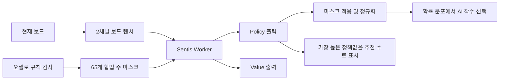

# AlphaBoard

Unity Sentis에서 ONNX 정책·가치망을 실행하는 AI 오셀로 게임입니다.

Self-play와 MCTS를 활용해 학습한 모델을 ONNX로 변환하고, Unity 클라이언트에서 현재 보드와 합법 수를 입력해 AI의 착수를 결정합니다. 게임 중 특정 조건을 만족하면 기본 모델에서 공격형 모델로 전환하며, 대사·캐릭터 이미지·이펙트·BGM도 함께 변경됩니다.

이 저장소에는 Unity 클라이언트와 변환된 ONNX 모델이 포함되어 있습니다. PyTorch 학습 코드는 포함되어 있지 않으며, Unity 런타임에서는 MCTS를 수행하지 않고 학습이 끝난 모델을 추론합니다.

## 프로젝트 특징

- 8×8 배열과 8방향 탐색으로 오셀로 규칙 구현
- Unity Sentis를 이용한 ONNX 모델 로컬 추론
- 보드 상태를 현재 턴 기준의 2채널 텐서로 변환
- C#에서 계산한 합법 수 마스크를 정책 출력에 적용
- 정책 분포 기반 AI 착수와 최고 정책값 기반 추천 수 표시
- 최근 플레이어 착수와 보드 상태를 이용한 공격형 모델 전환
- ScriptableObject 기반 대사 데이터와 코루틴·DOTween 연출
=======
**사용자의 턴에서 노란색 반짝임** : 현재 policy 확률 분포에서 가장 높은 값을 가진 수로, AI가 추천하는 힌트를 시각적으로 보여줍니다.

**게임 중간의 대사와 연출** : AI의 모델이 전환되는 시점입니다.

## 주요 기능
- 강화학습 적용된 AI와의 오셀로 전투
- AlphaZero 스타일 강화학습 기반(PyTorch 구현)
- 공격형 / 수비형 / 기본형 전략 모델 분리 학습
- Sentis를 활용한 ONNX 모델 로컬 추론
- 쉬움, 중간, 어려움 세가지 난이도 조절

## 기술 스택

| 구분 | 기술 |
| --- | --- |
| Engine | Unity `6000.0.47f1` |
| Language | C# |
| Model inference | Unity Sentis `2.1.2` |
| Model format | ONNX |
| Training | PyTorch, Self-play, MCTS 기반 정책·가치망 학습 |
| UI / Animation | TextMeshPro, uGUI, DOTween, Coroutine |

## 게임 흐름

```text
StartScene
   ↓
난이도 및 캐릭터 선택
   ↓
GameSettings.SelectedDifficulty에 선택값 저장
   ↓
MainGame
   ↓
플레이어와 AI가 번갈아 착수
   ↓
조건 충족 시 공격형 모델과 2페이즈 연출로 전환
   ↓
양쪽 모두 착수할 수 없으면 결과 연출 후 선택 화면으로 복귀
```

난이도 선택값은 게임 씬으로 전달되어 캐릭터 프리팹과 AI 정책 분포 설정에 반영됩니다.

## 오셀로 규칙 구현

보드는 `int[8, 8]` 배열로 관리합니다.

| 값 | 상태 |
| ---: | --- |
| `0` | 빈칸 |
| `1` | 플레이어의 검은 돌 |
| `-1` | AI의 흰 돌 |

플레이어가 빈칸을 선택하면 상하좌우와 대각선을 포함한 8방향을 검사합니다. 한 방향에서 연속된 상대 돌 뒤에 현재 플레이어의 돌이 있으면 유효한 착수로 판정하고, 사이에 있는 돌을 현재 플레이어의 돌로 변경합니다.

같은 검사 로직에 `actuallyFlip` 인자를 전달하여 합법 수 판정과 실제 뒤집기를 구분합니다.

```csharp
bool FlipAllDirections(int x, int y, int currentPlayer, bool actuallyFlip)
{
    bool flippedAny = false;

    for (int dx = -1; dx <= 1; dx++)
    {
        for (int dy = -1; dy <= 1; dy++)
        {
            if (dx == 0 && dy == 0)
                continue;

            if (TryFlipInDirection(x, y, dx, dy, currentPlayer, actuallyFlip))
                flippedAny = true;
        }
    }

    return flippedAny;
}
```

다음 플레이어에게 합법 수가 없으면 턴을 패스하고, 양쪽 모두 착수할 수 없으면 돌 개수를 계산해 게임을 종료합니다.

## AI 추론 구조

### 입력

보드 입력은 현재 턴 플레이어의 관점으로 구성합니다.

```text
shape: [1, 2, 8, 8]

channel 0: 현재 턴 플레이어의 돌
channel 1: 상대 플레이어의 돌
```

합법 수 입력은 보드의 64칸과 패스 행동을 포함한 65개 값으로 구성합니다.

```text
shape: [65]

index 0~63: 각 보드 칸의 착수 가능 여부
index 64  : 합법 수가 없을 때 사용하는 패스 행동
```

### 출력

모델은 두 출력을 반환합니다.

| 출력 | 의미 |
| --- | --- |
| `policy` | 64개 보드 위치와 패스를 포함한 65개 행동의 정책값 |
| `value` | 현재 턴 플레이어 관점의 보드 가치 추정값 (`-1`~`1`) |

`value`는 직접적인 승률이 아니라, 승리·패배 결과를 학습한 가치 헤드의 추정값입니다. `-1`에 가까울수록 현재 턴 플레이어에게 불리하고 `1`에 가까울수록 유리한 상태로 해석합니다.

### 합법 수 마스킹과 착수

Sentis `FunctionalGraph`에서 정책 출력에 합법 수 마스크를 곱하고 다시 정규화합니다. 이를 통해 모델이 높은 값을 출력하더라도 규칙상 둘 수 없는 위치는 선택 대상에서 제외됩니다.



AI의 실제 착수는 정책 분포에서 확률적으로 샘플링합니다. 플레이어에게 표시하는 추천 수는 합법 수 중 정책값이 가장 높은 위치를 사용합니다.

## AlphaZero 방식의 학습과 런타임 구분

학습 단계에서는 Self-play로 대국 데이터를 생성하고, MCTS로 얻은 탐색 정책과 최종 대국 결과를 이용해 정책·가치망을 학습했습니다. 학습이 끝난 모델은 ONNX로 변환했습니다.

```text
Self-play
   ↓
MCTS로 후보 수 탐색
   ↓
정책·가치망 학습
   ↓
ONNX 변환
   ↓
Unity Sentis에서 추론
```

Unity 빌드에서는 MCTS를 다시 실행하지 않습니다. 현재 보드를 ONNX 모델에 입력하고 `policy`와 `value`를 받아 게임 로직에 사용합니다.

## 공격형 모델 전환

게임 시작 시 다음 두 모델을 각각 로드해 Sentis Worker를 생성합니다.

| 역할 | ModelAsset |
| --- | --- |
| 기본 모델 | `Assets/Models/Final_models/v26_def2.onnx` |
| 공격형 모델 | `Assets/Models/Final_models/v27_off2.onnx` |

플레이어의 착수만 최근 5회까지 기록하며, 코너 좌표 `(0,0)`, `(0,7)`, `(7,0)`, `(7,7)`에 둔 수를 코너 착수로 분류합니다.

다음 조건을 모두 만족하면 `currentType`을 공격형으로 변경합니다.

```text
최근 플레이어 착수 5회 중 코너 착수가 1회 이상 포함
                            AND
플레이어의 검은 돌 수가 AI의 흰 돌 수보다 많음
                            AND
모델의 value 출력이 0보다 작음
```

두 모델은 시작 시 모두 준비되어 있으므로 전환 시 파일을 다시 로드하지 않습니다. 이후 AI 요청에서 `currentType`에 따라 공격형 Worker를 선택합니다. 한 번 공격형으로 전환되면 현재 게임이 끝날 때까지 유지됩니다.

모델 전환과 함께 다음 연출을 순서대로 실행합니다.

```text
게임 입력 일시 정지
   ↓
번개 및 효과음
   ↓
첫 번째 대사
   ↓
화면 전환
   ↓
캐릭터 이미지 변경
   ↓
두 번째 대사 및 BGM 변경
   ↓
AI 턴 재개
```

코루틴이 연출의 실행 순서를 관리하고, DOTween이 UI의 투명도·위치·크기 애니메이션을 처리합니다.

## 주요 스크립트

| 파일 | 역할 |
| --- | --- |
| `Assets/Scripts/OthelloGameMain.cs` | 보드 규칙, 턴 진행, Sentis 추론, 모델 전환, 게임 연출 |
| `Assets/Scripts/Piece.cs` | 보드 칸 클릭과 좌표 전달 |
| `Assets/Scripts/PatternTracking.cs` | 최근 플레이어 착수 5회와 코너 착수 기록 |
| `Assets/Scripts/GameSeetings.cs` | 선택한 난이도를 씬 사이에서 유지 |
| `Assets/Scripts/Dialogue/DialogueManager.cs` | 대사 출력, 타이핑 효과, 난이도 확정 |
| `Assets/Scripts/Dialogue/DialoueSequence.cs` | 대사와 캐릭터 이미지를 저장하는 ScriptableObject |
| `Assets/Scripts/CharacterVisual.cs` | 공격형 페이즈의 캐릭터 이미지 변경 |
| `Assets/Scripts/LightningEffect.cs` | 모델 전환 시 번개와 화면 플래시 연출 |
| `Assets/Scripts/CameraCharacter.cs` | 캐릭터 방향의 카메라 이동 연출 |

## 디렉터리 구조

```text
Assets/
├── Images/                         # 캐릭터 및 UI 이미지
├── Models/
│   ├── Final_models/
│   │   ├── v26_def2.onnx          # 기본 모델
│   │   └── v27_off2.onnx          # 공격형 모델
│   └── old models/                 # 모델 학습 및 변환 과정의 이전 결과물
├── Prefabs/                        # 돌 및 캐릭터 프리팹
├── Scenes/
│   ├── StartScene.unity           # 타이틀
│   ├── the last revelation.unity  # 난이도 및 캐릭터 선택
│   └── MainGame.unity             # 오셀로 대전
├── Scripts/
│   ├── Dialogue/                   # 대사 데이터와 출력 로직
│   ├── OthelloGameMain.cs          # 메인 게임 로직
│   ├── PatternTracking.cs          # 플레이어 착수 기록
│   └── Piece.cs                    # 보드 칸 입력
└── Sounds/                         # BGM 및 효과음
```

## 실행 방법

### 요구 환경

- Unity Hub
- Unity Editor `6000.0.47f1`

### 실행

```bash
git clone https://github.com/taegwan-lee/AlphaBoard.git
```

1. Unity Hub에서 클론한 프로젝트 폴더를 추가합니다.
2. Unity `6000.0.47f1`로 프로젝트를 엽니다.
3. `Assets/Scenes/StartScene.unity`를 엽니다.
4. Unity Editor의 Play 버튼을 누릅니다.

빌드 설정에는 `StartScene`, `MainGame`, `the last revelation` 씬이 포함되어 있습니다. 실제 플레이 흐름은 다음과 같습니다.

```text
StartScene → the last revelation → MainGame → the last revelation
```

게임 화면에서 `Esc` 키를 누르면 애플리케이션을 종료합니다.

## 개선 방향

- 공격형과 기본 모델의 행동 차이를 승률, 코너 선택률을 충분히 정량화하지 못했습니다.
- 모델 간 반복 대전 환경을 구축해 플레이 강도와 전략 차이를 비교할 필요가 있습니다.
- 난이도별 정책 분포 설정은 실제 승률을 측정해 다시 조정할 필요가 있습니다.

## License

별도의 라이선스가 명시되지 않은 프로젝트입니다. 코드 및 리소스 사용 전 저장소 소유자에게 문의해 주세요.
